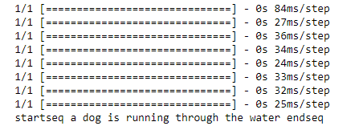
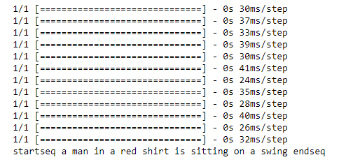

# Neural Style Captioning
*Playground for Captioning Images.


### Based on
[https://arxiv.org/abs/1703.09137](https://arxiv.org/abs/1703.09137)
### Dataset
[https://forms.illinois.edu/sec/1713398](https://forms.illinois.edu/sec/1713398)
## Prerequisites
* python3
### Installation
```sh
 git clone https://github.com/shan1322/Neural-Style-Captioning
 cd Neural Style Captioning
 pip3 install -r requirements.txt
 ```
 ### Running
```sh
 run cap.ipynb
```
### Links refferd
[Tokenizing](https://keras.io/preprocessing/text/).


[LSTM in caption model](https://github.com/keras-team/keras/blob/master/examples/lstm_text_generation.py).
### Error in small parts of prediction


* due to lack of training 
